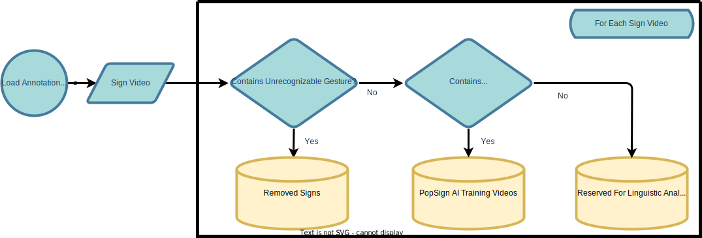

# ASL-CDI Variant-Analysis
This is for the linguistic analysis of variants collected in the duration of the creation of the PopSignAI v.1.0 Dataset.

- [ASL-CDI Variant-Analysis](#asl-cdi-variant-analysis)
  - [Review Process](#review-process)
    - [Pass 1](#pass-1)
  - [ASL-LEX ASL-CDI subset](#asl-lex-asl-cdi-subset)
  - [Thoughts](#thoughts)

## Review Process 
### Pass 1

## ASL-LEX ASL-CDI subset 
after parsing the rows from ASL-LEX its come to my attention that not all of the ASL-CDI Signs are not within it. 

## Thoughts
>ASL-LEX is a publicly available, large-scale lexical database for American Sign Language (ASL). We report on the expanded database (ASL-LEX 2.0) that contains 2,723 ASL signs. For each sign, ASL-LEX now includes a more detailed phonological description, phonological density and complexity measures, frequency ratings (from deaf signers), iconicity ratings (from hearing non-signers and deaf signers), transparency ("guessability") ratings (from non-signers), sign and videoclip durations, lexical class, and more. We document the steps used to create ASL-LEX 2.0 and describe the distributional characteristics for sign properties across the lexicon and examine the relationships among lexical and phonological properties of signs. Correlation analyses revealed that frequent signs were less iconic and phonologically simpler than infrequent signs and iconic signs tended to be phonologically simpler than less iconic signs. The complete ASL-LEX dataset and supplementary materials are available at https://osf.io/zpha4/ and an interactive visualization of the entire lexicon can be accessed on the ASL-LEX page: http://asl-lex.org/
We can potentially use this to bootstrap analysis.

